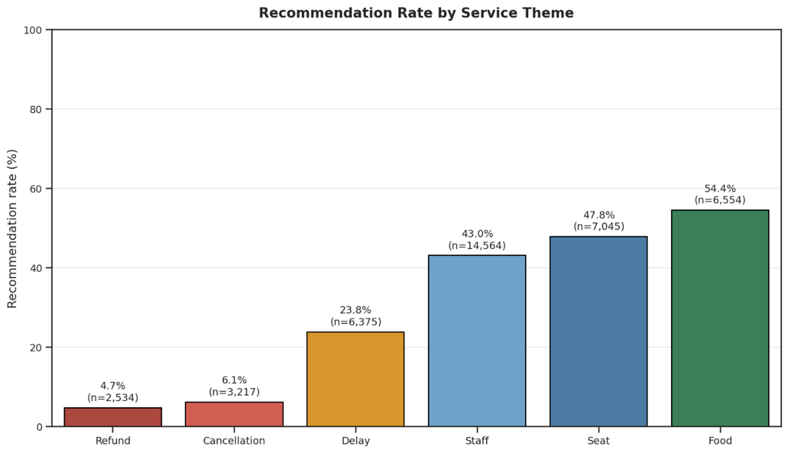
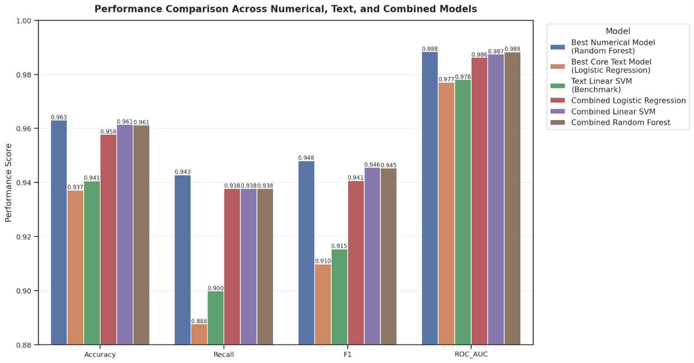
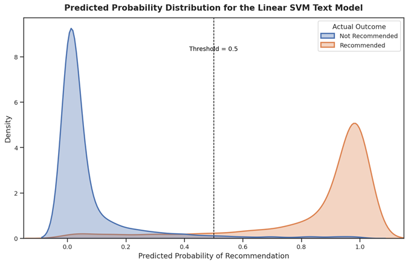
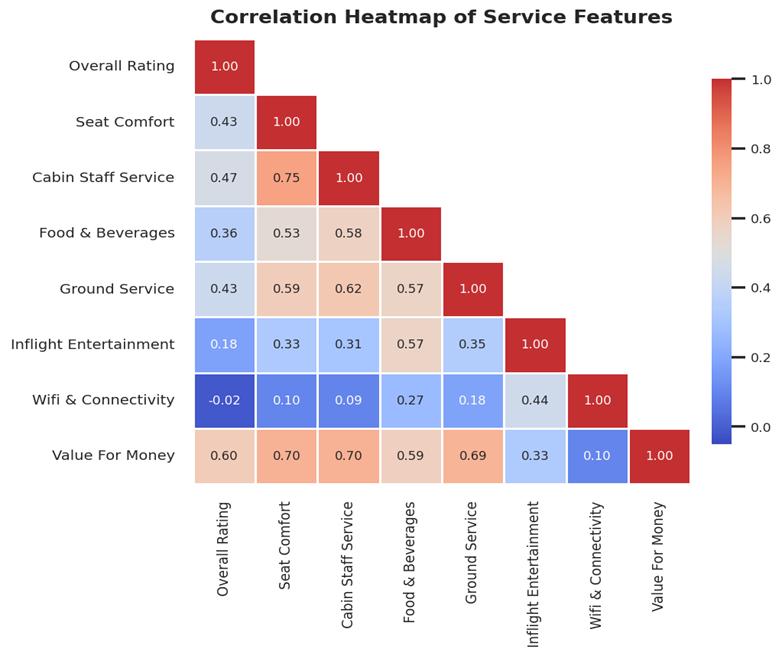

# Airline Customer Satisfaction Analytics

## Project Overview

This project analyses airline customer review data to understand what drives customer recommendation behaviour. The analysis combines numerical ratings, text analytics, sentiment analysis, and machine learning to identify the service, sentiment, and value-for-money factors most associated with customer satisfaction and dissatisfaction.

## Project Highlights

- Analysed airline customer reviews using structured ratings and written feedback.
- Assessed multiple service dimensions including value for money, seat comfort, cabin staff service, food and beverages, ground service, and entertainment.
- Combined numerical ratings, sentiment analysis, text analytics, and predictive modelling in one workflow.
- Compared multiple classification models to evaluate recommendation prediction performance.
- Included robustness testing, threshold analysis, contradiction analysis, and model limitation discussion.
- Built and compared classification models, with the best-performing model achieving 96.3% accuracy and 98.8% ROC-AUC in predicting recommendation behaviour.
- Python implementation received full marks in academic evaluation.

## Business Problem

Airlines receive large volumes of customer feedback through reviews and ratings, but the key drivers of recommendation behaviour are not always obvious. The goal of this project is to identify which service dimensions, sentiment patterns, and text-based signals are most linked to whether a customer recommends an airline.

## Objectives

- Analyse customer review ratings and written feedback.
- Identify service factors linked to recommendation behaviour.
- Apply sentiment analysis to understand positive and negative customer experiences.
- Build machine learning models to classify recommendation outcomes.
- Translate analytical findings into practical business recommendations.

## Tools, Methods, and Analytical Approach

- **Python:** data preparation, analysis, modelling, and visualisation.
- **pandas and NumPy:** data cleaning, transformation, and structured analysis.
- **NLP and text preprocessing:** review text preparation and feature extraction.
- **VADER and RoBERTa:** sentiment analysis to compare rule-based and transformer-based approaches.
- **TF-IDF:** text feature extraction for predictive modelling.
- **scikit-learn:** classification modelling, model comparison, and evaluation.
- **Feature importance analysis:** interpretation of key drivers linked to recommendation behaviour.

## Key Findings

- Customer recommendation is strongly influenced by service experience and value-for-money perceptions.
- Negative sentiment in review text is closely linked to non-recommendation behaviour.
- Text analytics helped identify recurring dissatisfaction themes that were not fully visible from ratings alone.
- Machine learning models provided a structured way to classify recommendation outcomes and interpret key drivers.

## Analytical Outcomes and Decision Value

- Designed classification models to predict whether customers would recommend an airline based on structured service ratings and written review text.
- The best-performing model achieved 96.3% accuracy and 98.8% ROC-AUC, showing that customer feedback data can provide strong signals for recommendation behaviour.
- Model outputs were interpreted in business terms to identify likely promoters, dissatisfied customers, and customer experience improvement priorities.

## Business Recommendations

- **Prioritise recurring service failure themes.**  
  Reviews linked to refund, cancellation, and delay themes showed much lower recommendation rates than service-positive themes such as food, seat, and staff. Airlines should use these themes as early-warning categories for customer experience improvement and operational review.

- **Treat value for money as a key recommendation driver.**  
  Value-for-money showed strong relationships with overall satisfaction and other service ratings. Airlines should monitor this as a core customer experience KPI, especially when evaluating pricing, service quality, and perceived fairness.

- **Use sentiment analysis to detect dissatisfaction earlier.**  
  Text-based sentiment signals helped identify negative customer experiences that may not be fully captured by numerical ratings alone. Airlines could use sentiment monitoring to flag high-risk reviews and identify emerging complaint patterns.

- **Combine structured ratings with review text for better customer insight.**  
  The best-performing models showed that recommendation behaviour can be predicted more effectively when numerical ratings and written feedback are analysed together. Airlines should avoid relying only on rating scores and instead use a combined view of customer feedback.

- **Translate model outputs into service improvement priorities.**  
  Classification results can help identify likely promoters and dissatisfied customers, while feature and theme analysis can show where improvement efforts should be focused. This makes the analysis useful not only for prediction, but also for customer experience planning.

## Key Visuals

### Recommendation Rate by Service Theme


### Model Performance Comparison


### Predicted Probability Distribution


### Service Feature Correlation Heatmap


## Academic Feedback Highlights

This project received positive academic feedback for its strong preprocessing, audit-style explanation, and transparent handling of data quality issues. The analysis was also recognised for its depth across both numerical and textual analytics, with clear links between descriptive findings, predictive modelling, and business interpretation.

Particular strengths highlighted included robustness testing, threshold analysis, contradiction analysis, hybrid modelling, and critical discussion of model limitations. The Python code received full marks, reflecting the reproducibility and technical quality of the implementation.

## Report

The full project report is available in the `report/` folder:

[View Full Report](report/Airline-Customer-Satisfaction-Report.pdf)

## Repository Structure

```text
code/       Analysis notebook or scripts
visuals/    Key charts and model outputs
report/     Final project report
data/       Data notes or sample data information
